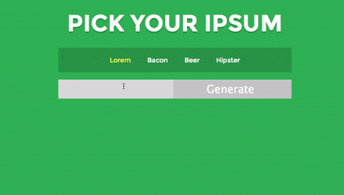

# Homework 6 - Pick Your Ipsum

Create an app that will allow you to pick a different type of Ipsum and select a certain number of paragraphs of it.

### Step 1 - Fork this repository.

From the assignment homepage (https://github.com/fewd90nyc/fewd90week6), click the "Fork" link on the top right. This will create a copy of the assignment in YOUR github account.

### Step 2 - Clone your forked repository.

From the repository homepage (which will be http://github.com/YOURUSERNAME/fewd90week6), click on green "Clone or Download" button and "Open in Desktop". This should open your Github Desktop App and prompt you to save the fewd90week6 folder on your computer.

### Step 3 - Build!

There are three events that need to be defined: 

When the user clicks on a nav anchor:

- The item the user clicked on should be selected (the class `.current` can be applied).

When the user hits the Generate button:

- The specified number of paragraphs of the selected ipsum should be revealed with a sliding animation.

When the user clicks or tabs into the form field: 

- The field should clear and the revealed ipsum should disappear with a sliding animation.

You will likely need to use all of the following jQuery functions: `.click(), .focus(), .removeClass(), .addClass(), .data(), .slice(), .find(), .hide(), .slideDown(), .slideUp()`. Check the jQuery documentation for what each of these do: https://api.jquery.com/

Your solution should be generic enough that you could add one or many more ipsums to the list and have it still work.

**Note:** I've included jQuery for you in the JS folder, but you will need to create your own JS file as well as add the appropriate `<script>` tags.

### Step 4 - Commit and Sync

Work on your website locally and view it in the browser by opening your index.html file. When your site looks good, Commit and Sync with the Github App.

### Step 5 - Pull Request

Send a Pull Request to submit your homework. From your fewd90week6 page on github.com (https://github.com/YOURUSERNAME/fewd90week6), click on the "New Pull Request" button and follow the prompts. 

### Step 6 - Publish with [Gitbot](http://gitbot.co/)! (optional)

Want to post your fewd90week6 project on your github.io url? Log into gitbot and click the fewd90week6 repository button and VOILA! It will (perhaps after a few minutes) be viewable online at http://YOURUSERNAME.github.io/fewd90week6

